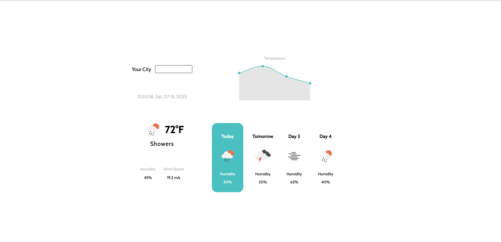

# Weather App

## Description

The Weather App is a simple web application that allows users to check the weather forecast for a specific city. It is built using HTML, CSS, and JavaScript and utilizes the OpenWeather API to fetch weather data. The app also incorporates Chart.js to display a graphical representation of the temperature forecast for the next few days.

## Demo

You can see a live demo of the Weather App at [Weather App Demo](https://raheemelassadi.github.io/weatherapp/)

## Features

- Check current weather details (temperature, description, humidity, and wind speed) for a specified city.
- View weather forecast for the next few days with graphical representation using Chart.js.
- Responsive design for seamless user experience on various devices.

## Technologies Used

- HTML
- CSS
- JavaScript
- [OpenWeather API](https://openweathermap.org/api) - For fetching weather data
- [Chart.js](https://www.chartjs.org/) - For displaying weather forecast chart

## Installation

1. Clone the repository from GitHub:

git clone https://github.com/raheemelassadi/weather-app.git

2. Navigate to the project directory:

3. Open the `index.html` file in your web browser.

## Usage

1. Enter the name of the city you want to check the weather for in the "Your City" input field.

2. Press the "Enter" key or click the "Search" button to fetch the weather details.

3. The current weather details will be displayed on the left side, along with a weather icon representing the weather condition.

4. The weather forecast for the next few days will be displayed on the right side as a line chart using Chart.js.

## Contributing

If you would like to contribute to the Weather App, you can follow these steps:

1. Fork the repository from [GitHub](https://github.com/raheemelassadi/weather-app).

2. Create a new branch for your feature or bug fix.

3. Make your changes and commit them with descriptive commit messages.

4. Push your changes to your forked repository.

5. Create a pull request to the original repository.

## Credits

- Weather data provided by [OpenWeather API](https://openweathermap.org/api).
- Chart.js library by [Chart.js](https://www.chartjs.org/).

## License

The Weather App is open-source software licensed under the [MIT License](LICENSE).

## Contact

For any inquiries or feedback, you can contact me via email: [raheem.elassadi@example.com](mailto:raheem.elassadi@example.com).

---

